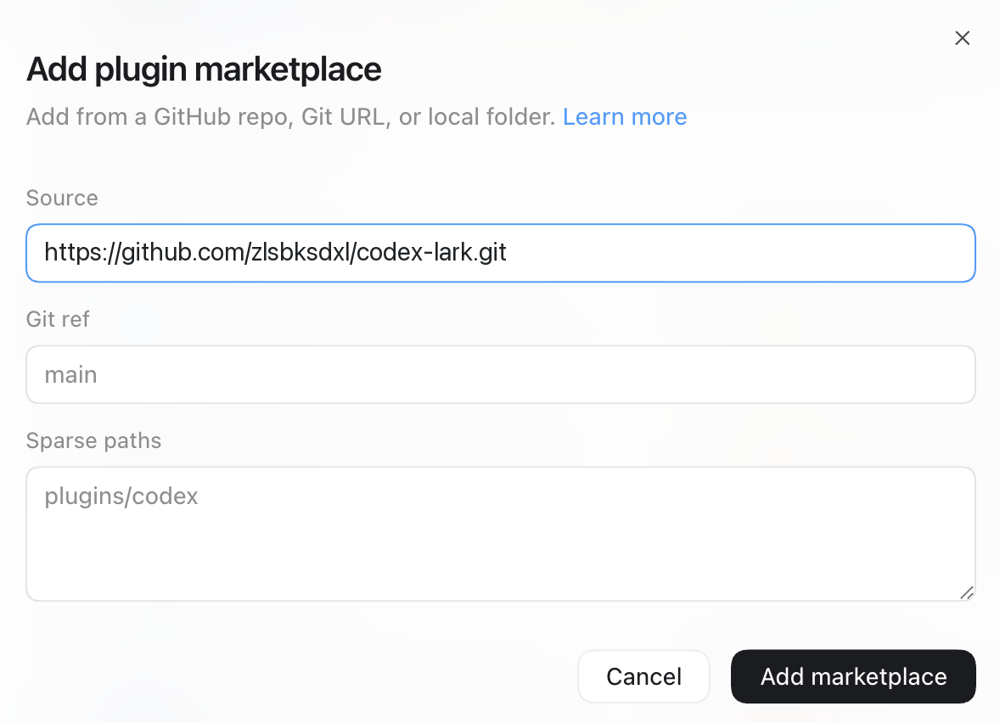

# Codex Lark

[English](README.md) | 简体中文

这是一个通过官方 [Lark CLI](https://github.com/larksuite/cli) 提供飞书/Lark 工作流的 Git-backed Codex Marketplace。

> 本仓库由社区维护，不代表 LarkSuite/飞书官方发布。

## 插件

| 插件 | 功能 | 额外要求 |
| --- | --- | --- |
| `feishu2codex` | 提供 27 个上游 Lark CLI Skills 和 1 个引导设置 Skill，覆盖文档、知识库、多维表格、消息、日历、任务、会议、邮箱、审批等工作流 | 首次设置运行时需要 Node.js/npm，并需完成飞书/Lark OAuth 授权 |

## 插件功能

本插件将官方 [Lark CLI](https://github.com/larksuite/cli) 面向 AI Agent 的工作流打包到 Codex，通过结构化 CLI 命令操作飞书/Lark。

| 领域 | 支持的能力 |
| --- | --- |
| 即时通讯 | 发送和回复消息、搜索聊天记录、管理群聊与成员，处理媒体文件、表情回复、交互卡片和加急消息。 |
| 云文档与云空间 | 创建、读取和编辑文档；上传、下载、整理、搜索、导入和导出文件；管理权限、评论、版本和密级标签。 |
| Markdown、知识库与画板 | 编辑云空间中的原生 Markdown 文件，管理知识空间、节点与成员，查看或更新画板。 |
| 电子表格与多维表格 | 编辑单元格、公式、图表、透视表和格式；管理 Base 数据表、字段、记录、视图、表单、仪表盘、工作流和角色权限。 |
| 幻灯片 | 创建演示文稿、读取幻灯片内容，以及新增、删除或局部更新页面。 |
| 日历与任务 | 管理日程、参会人、会议室、忙闲和时间建议；创建并组织任务、清单、子任务、提醒、负责人和附件。 |
| 视频会议与妙记 | 搜索历史会议，获取总结、待办、章节、逐字稿、录制和妙记产物；在授权后支持 Agent 会中操作。 |
| 邮箱与通讯录 | 搜索、阅读、起草、发送、回复和转发邮件，管理收信规则；按姓名、邮箱、手机号或 Open ID 解析人员信息。 |
| 审批、考勤与 OKR | 查询并处理审批任务和实例，查看个人考勤记录，管理目标、关键结果、对齐关系、指标和进展。 |
| 应用、事件与自动化 | 创建和发布妙搭 Spark/Miaoda 应用，管理环境与自动化，消费飞书实时事件，生成会议汇总或站会日报。 |
| 扩展能力 | 探索现有命令未覆盖的飞书 OpenAPI，并将可重复的 API 流程封装为自定义 Skill。 |

Lark CLI 支持用户与应用两种身份、按 scope 授权、结构化 JSON 输出、`dry-run` 预览和高风险写操作确认门禁；本插件在 Codex 工作流中保留这些安全控制。

## 在 Codex 中添加这个 Marketplace

### 桌面应用

1. 打开 **Codex → Plugins**。
2. 打开插件搜索框旁的 Marketplace 来源菜单，选择 **+ Add More**。

   

3. 粘贴本仓库地址：

   ```text
   https://github.com/zlsbksdxl/codex-lark.git
   ```

   

4. 选择 **Codex Lark**，打开 `feishu2codex` 并安装。

必须填写 Git 仓库 URL，不要填写原始 `marketplace.json` URL。Codex 会克隆仓库并自动发现 `.agents/plugins/marketplace.json`。

### CLI

```bash
codex plugin marketplace add \
  'https://github.com/zlsbksdxl/codex-lark.git' \
  --ref main \
  --sparse '.agents/plugins' \
  --sparse 'plugins'

codex plugin list --marketplace codex-lark --available --json
codex plugin add feishu2codex@codex-lark
```

安装后请完全重启 ChatGPT/Codex 桌面应用，检查并信任插件的设置 Hook，然后在新任务中使用插件，以便加载 Skills 和 Hook。

## 连接飞书/Lark

新建一个任务并输入：

> 帮我设置并连接飞书/Lark 到 Codex。

Codex 不会在 Marketplace 安装事务内执行任意命令。首个新任务启动时，插件中已信任的设置 Hook 会在缺失时安装匹配的 `lark-cli` 运行时，并在完成设置前将飞书/Lark 工作流标记为未就绪。内置的 `lark-setup` Skill 随后初始化应用配置并启动浏览器/设备 OAuth。对应的手动命令如下：

```bash
npm install --global --no-audit --no-fund @larksuite/cli@1.0.73
lark-cli config init --new
lark-cli auth login --recommend
lark-cli auth status --json --verify
```

凭据保存在用户本机。建议按实际任务申请最小权限。

## 更新

```bash
codex plugin marketplace upgrade codex-lark
codex plugin add feishu2codex@codex-lark
```

## 仓库结构

```text
.
├── .agents/plugins/marketplace.json
└── plugins/
    └── feishu2codex/
```

## 上游与许可证

- [Lark CLI](https://github.com/larksuite/cli), MIT
- 本仓库的打包和文档使用 [MIT License](LICENSE)

## 开发与校验

```bash
./scripts/validate-marketplace.sh
```

GitHub Actions 会对每次 push 和 pull request 执行同一结构校验。发布前还应使用 Codex 的 `plugin-creator` 和 `skill-creator` 校验器检查插件与 Skills。

安全问题请参阅 [SECURITY.md](SECURITY.md)。
